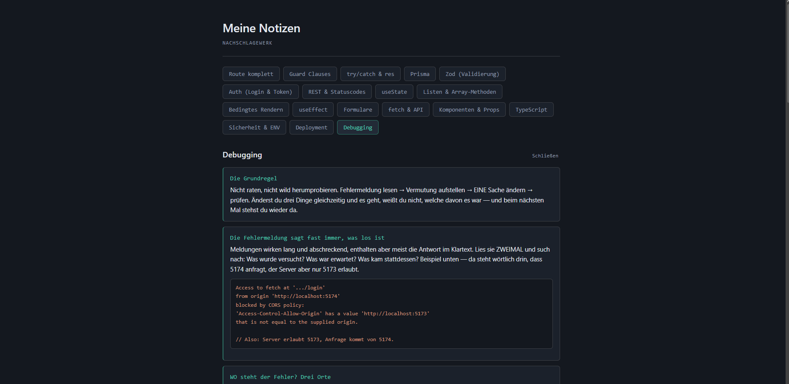

# Notizen

Persönliches Nachschlagewerk für React, TypeScript und Backend-Themen. Themen werden per Button aufgerufen und als Liste oder Tabelle dargestellt.

**Live:** [https://notizen.alexander-bartmann.de](https://notizen.alexander-bartmann.de)


---

## Warum

Beim Lernen tauchen dieselben Fragen immer wieder auf — wie war noch mal der Aufbau einer Express-Route, was macht `??` gegenüber `||`. Statt jedes Mal zu googeln oder Stack Overflow zu durchsuchen, steht hier alles in eigenen Worten an einer Stelle.

Der Nebeneffekt: Etwas selbst zu formulieren zwingt dazu, es verstanden zu haben.

---

## Tech Stack

React 19 · TypeScript · Vite · CSS

Bewusst ohne Router, ohne State-Management-Bibliothek und ohne Backend. Der Umfang rechtfertigt keine zusätzlichen Abhängigkeiten.

---

## Datenmodell

Der Kern des Projekts. Die Inhalte liegen in `src/data/topics.ts`, nicht in der Komponente:

```ts
export interface Entry {
  label: string;
  description: string;
  code?: string;
}

export interface Topic {
  id: string;
  title: string;
  layout: "liste" | "tabelle";
  entries: Entry[];
}
```

**Warum getrennt:** Ein neues Thema hinzuzufügen heißt, ein Objekt in ein Array zu schreiben. Die Komponente wird dabei nie angefasst. Sie zeigt Daten an, sie besitzt sie nicht.

**Warum verschachtelt statt über IDs verknüpft:** Einträge gehören immer zu genau einem Thema und werden nie einzeln gebraucht. In einer Datenbank wäre eine Fremdschlüsselbeziehung nötig, hier reicht ein verschachteltes Array — und der Zugriff ist `topic.entries` statt einer Filteroperation bei jedem Klick.

**Das `layout`-Feld** steuert die Darstellung: Union-Type statt `string`, damit Tippfehler beim Schreiben auffallen und der Editor die gültigen Werte vorschlägt. Manche Inhalte sind als Liste sinnvoll, Statuscodes und REST-Methoden als Tabelle.

---

## Umsetzung

Die gesamte Anwendung besteht aus einer Komponente mit einem State:

```ts
const [aktivesThema, setAktivesThema] = useState<Topic | null>(null);
```

`null` als Startwert bedeutet "nichts ausgewählt" — das Conditional Rendering hängt direkt daran. Ein `.map()` erzeugt die Buttons, ein zweites die Einträge des gewählten Themas.

Das Styling ist handgeschriebenes CSS mit Custom Properties für Farben und Abstände, mobile-first aufgebaut.

---

## Zum Projekt

Entstanden als Übung, um eine vollständige React-Anwendung ohne Vorlage von Grund auf zu bauen — vom Datenmodell über die Komponentenstruktur bis zum Deployment. Wird seitdem tatsächlich benutzt und wächst mit jedem gelernten Thema.

---

**Alexander Bartmann**
[alexander-bartmann.de](https://alexander-bartmann.de)
